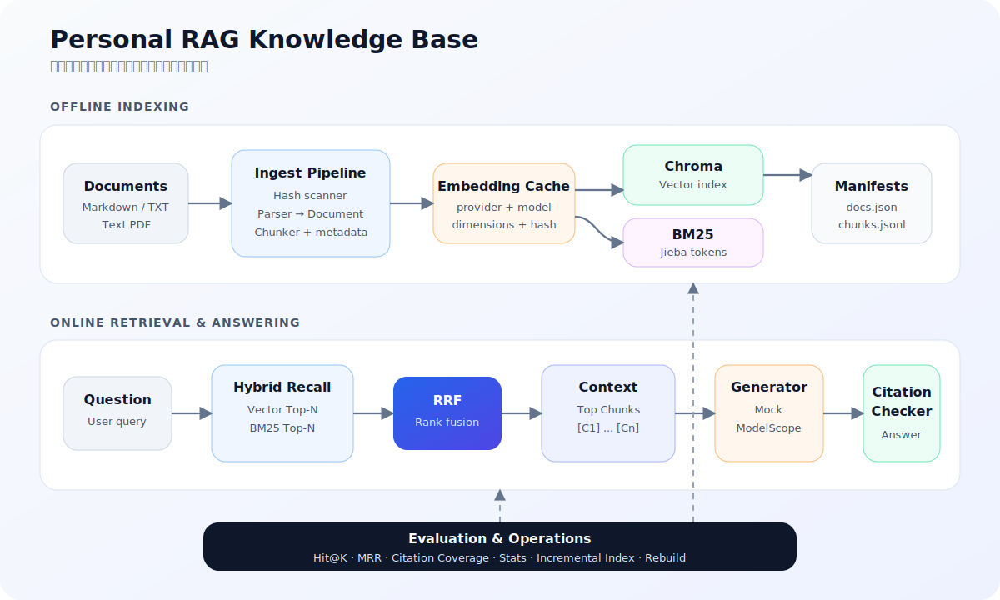

# Personal RAG Knowledge Base

[](https://github.com/wjh4sg/personal-rag-knowledge-base/actions/workflows/ci.yml)

一个面向面试展示的本地多源文档 RAG MVP。它支持 Markdown、TXT 和文本型
PDF，提供增量索引、Chroma 向量检索、BM25 关键词检索、RRF 融合、带引用问答
以及 Hit@K / MRR 评估。

## 安装

需要 Python 3.11 或更高版本，推荐 Python 3.12：

```powershell
py -3.12 -m pip install -e ".[dev]"
```

安装后可使用 `rag` 命令。如果 Python Scripts 目录不在 `PATH`，可使用：

```powershell
py -3.12 -m personal_rag.cli --help
```

## 演示命令

```powershell
rag index ./examples/docs
rag search "RAG 为什么需要 Rerank？"
rag ask "这个系统怎么做增量索引？"
rag stats
rag eval ./eval/dataset.json
rag rebuild ./examples/docs
```

默认配置使用确定性 Mock embedding 和 Mock generator，因此断网也能展示完整
链路。第二次执行 `rag index` 会跳过所有未变化文件。

## Demo 输出示例

以下输出来自仓库自带语料和默认 Mock 模式，省略了部分长文本。

### `rag index`

```text
扫描文件：4 个
新增文件：4 个
逻辑文档数：8
总 Chunk 数：8
Embedding 缓存命中：0
Chroma 向量索引：完成
BM25 关键词索引：完成
```

### `rag search`

```text
Top 5 检索结果：

[1] rag_notes.md#混合检索与精排
score: 0.032787
source: fusion
内容：RAG 为什么需要 Rerank？因为第一阶段召回强调尽量不要漏掉相关内容……
```

### `rag ask`

```text
回答：
根据检索资料，系统先计算文件内容 Hash。Hash 不变时跳过，变化时替换旧 Chunk
和旧向量，并重建 BM25。[C1]

生成模式：mock

引用：
[C1] rag_design.md#增量索引
```

### `rag stats`

```text
文件数：4
文档数：8
Chunk 数：8
向量索引：已构建
BM25 索引：已构建
Embedding 模式：mock
```

### `rag eval`

```text
评估样本数：3
Hit@1: 1.00
Hit@3: 1.00
MRR: 1.00
引用覆盖率：1.00
无引用回答数：0
```

### `rag rebuild`

```text
清理现有索引并开始全量重建（保留 Embedding 缓存）……
扫描文件：4 个
新增文件：4 个
Embedding 缓存命中：8
Chroma 向量索引：完成
BM25 关键词索引：完成
```

## 使用魔搭 API

在 Windows 用户环境变量中创建：

```text
MODELSCOPE_API_KEY=<你的魔搭 SDK Token>
```

不要把 Token 写进 YAML、源码或 Git。随后把
[`config/config.yaml`](config/config.yaml) 中的 provider mode 改为：

```yaml
provider:
  mode: api
```

默认真实模型：

```text
Embedding: Qwen/Qwen3-Embedding-0.6B
LLM: Qwen/Qwen3-30B-A3B-Instruct-2507
Base URL: https://api-inference.modelscope.cn/v1
```

Embedding 请求显式发送 `encoding_format: float`。魔搭免费 API 用于试用和评估，
不保证生产 SLA；API 问答失败且 `fallback_to_mock: true` 时，`ask` 会明确显示
`mock-fallback`。

## 架构



```text
文档目录
  -> 文件 Hash 与增量扫描
  -> Markdown / TXT / PDF 解析
  -> Document / Chunk
  -> Embedding 缓存
  -> Chroma + BM25
  -> Vector / BM25 两路召回
  -> RRF 融合
  -> C1..Cn 上下文
  -> Mock 或 ModelScope LLM
  -> 引用合法性检查
```

`chunks.jsonl` 是检索内容的权威记录。Chroma 与 BM25 是派生索引。引用检查保证
模型只能引用本轮检索到的 Chunk，但它不等价于逐句事实忠实性评估。

## 面试讲解重点

- **离线索引**：通过文件 Hash 判断新增、修改、删除和未变化文档；解析后统一为
  Document / Chunk，并同时构建 Chroma 向量索引与 Jieba + BM25 关键词索引。
- **在线问答**：Vector 与 BM25 两路召回后使用 RRF 基于排名融合，再构造带
  `[C1]...[Cn]` 的上下文；生成后只保留本轮检索结果中的合法引用。
- **工程可靠性**：增量索引减少重复工作，Embedding 缓存绑定 provider、model、
  dimensions 和 chunk hash；`rebuild` 在保留缓存的同时修复索引状态，Mock 与
  ModelScope 两种模式兼顾稳定演示和真实效果。
- **效果验证**：使用 Hit@K、MRR 和引用覆盖率衡量检索与引用表现，并通过 CLI
  acceptance tests 和 GitHub Actions 自动验证完整演示链路。

## 数据与配置

- 默认配置：`config/config.yaml`
- 文档状态：`data/storage/docs.json`
- Chunk：`data/storage/chunks.jsonl`
- BM25：`data/storage/bm25.pkl`
- Chroma：`data/storage/chroma/`
- Embedding 缓存：`data/cache/embeddings/`

相对源路径统一保存为 POSIX 格式，不写入绝对文档路径。缓存键绑定 provider、
模型、维度与 `chunk_hash`。

## 测试

离线测试：

```powershell
py -3.12 -m pytest -m "not live" -q
```

魔搭在线烟雾测试：

```powershell
py -3.12 -m pytest tests/live/test_modelscope.py -m live -q
```

静态检查：

```powershell
py -3.12 -m ruff check .
```

## 版本管理

项目遵循 [Semantic Versioning](https://semver.org/)：

- `v0.1.x`：兼容性修复和小幅改进。
- `v0.2.0`：加入 OCR、真实 Reranker 等新能力。
- `v1.0.0`：接口和存储格式达到稳定承诺。

每次发布同步更新 `pyproject.toml`、`CHANGELOG.md`、Git 标签和 GitHub Release。

## 常见错误

- `401/403`：确认用户环境变量 `MODELSCOPE_API_KEY` 已设置，并重启终端或 Codex。
- `429`：免费额度或频率限制已触发，稍后重试，或切回 `mock`。
- 请求超时：检查网络并调整 `provider.timeout_seconds`。
- 提示索引不存在：先运行 `rag index ./examples/docs`。
- Chroma/BM25 损坏或索引不完整：运行 `rag rebuild ./examples/docs`。

## v0.1 边界

第一版不支持扫描 PDF OCR、复杂表格 PDF、图片、多用户、Web UI、Agent、多轮长期
记忆、真实 cross-encoder reranker 或 RAGAS。它们属于后续增强项。

## License

[MIT](LICENSE)
